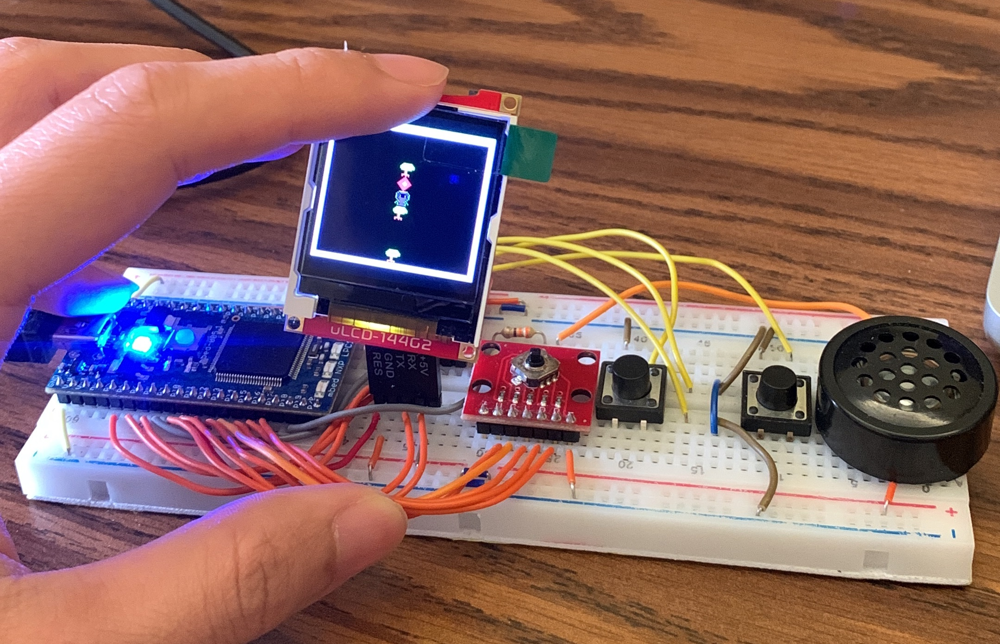

# RPG Game using NXP LPC1768

## Overview

This project is an exciting Role-Playing Game (RPG) developed using the NXP LPC1768 microcontroller and programmed in C language with KEIL Studio. The game features an engaging storyline, battles with enemies, character progression, different maps, and much more. To efficiently manage game data, we use HashMap data structures to store and retrieve information about characters, items, and locations in the game world.

## Features

- Interactive RPG gameplay with a captivating storyline to defeat monsters.
- Turn-based battles with various enemies, each with unique abilities and attributes.
- Character progression and leveling up system.
- An expansive game world with two maps to explore.
- NPCs (Non-Player Characters) with dialogues and quests.

## Hardware Requirements

To run the RPG game, you'll need the following:

- mbed NXP LPC1768 microcontroller board.
- Nav Switch
- Push Button
- uLCD Display

## Software Requirements

- Keil studio IDE for C programming and code development.
- Appropriate libraries and drivers for the mbed LPC1768 board.

## How to Play

1. Connect the mbed LPC1768 board to the display module and input devices.
2. Load the compiled game binary onto the microcontroller.
3. Power on the setup, and the game will start on the display.
4. Use the input devices to navigate the game world, interact with NPCs, and battle enemies.
5. Follow the storyline, complete quests, and explore the vast RPG world!

## HashMap Data Structures

HashMaps are an essential part of this project, enabling efficient data storage and retrieval. We utilize HashMaps to manage game-related data, including character attributes, item statistics, and location details. This allows for quick access to information during gameplay, enhancing the overall performance and experience.

## Game Development

The game was developed in C language using Keil studio IDE, leveraging the capabilities of the mbed NXP LPC1768 microcontroller. We aimed to create an enjoyable RPG experience with dynamic gameplay elements, engaging combat mechanics, and an immersive storyline.

## Getting Started

To get started with this project, follow these steps:

1. Set up the mbed NXP LPC1768 board with the required peripherals.
2. Install Keil uVision IDE and configure the project with appropriate libraries.
3. Clone or download the RPG Game source code from the repository.
4. Compile and load the binary onto the microcontroller.
5. Power on the setup and start playing the RPG Game!

## Additional Notes

- This is one of the homework I did for GT ECE 2035. 

For any inquiries or feedback related to this project, please contact me.
